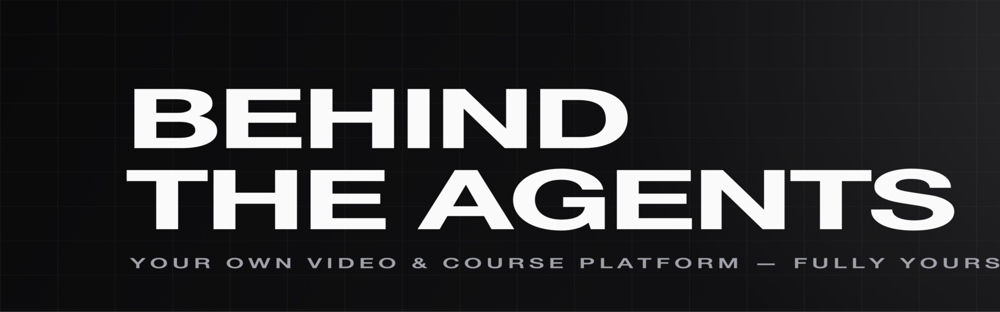
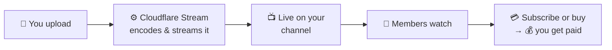
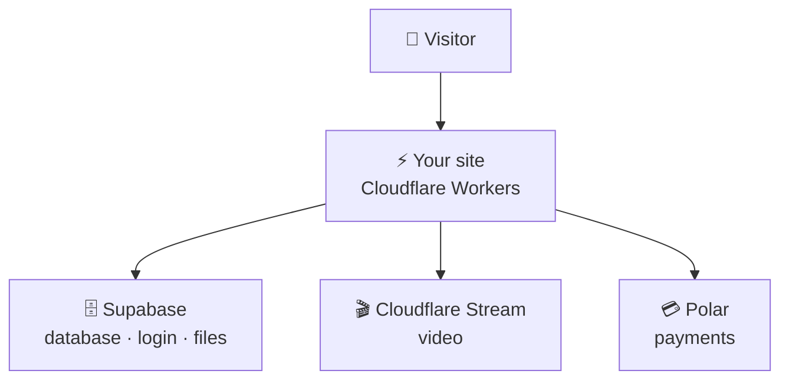
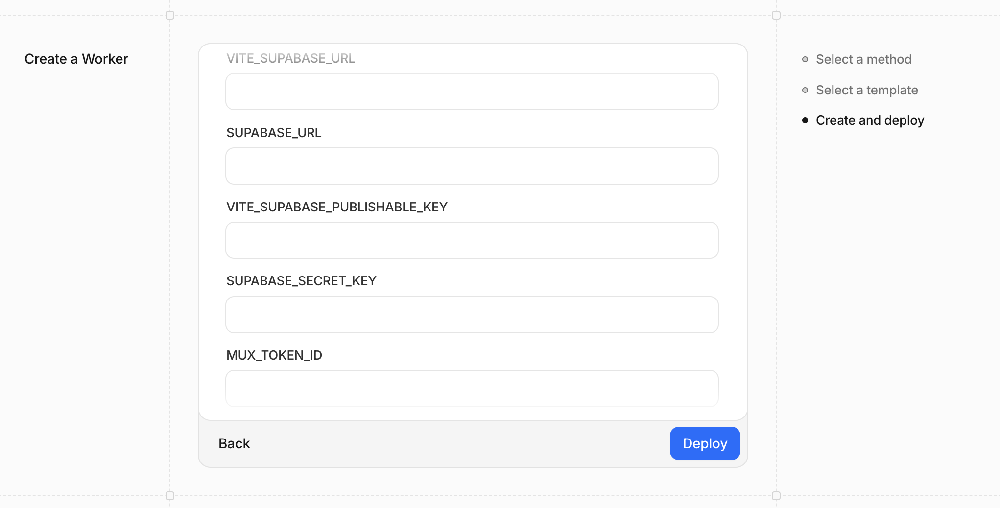

<div align="center">



# 🎬 Behind The Agents

### Your own Netflix-style channel for selling videos & courses — that you **100% own**.

No platform fees. No lock-in. Live in minutes — by yourself, or with an AI agent.


</div>

---

## 🤔 What is this?

It's a **complete, ready-to-run website for publishing and selling your own videos and courses** — like running your own mini-Netflix.

Your brand. Your audience. Your money. You upload videos, choose what's free and what's paid, and viewers watch, subscribe, or buy — all on a fast, beautiful site that **you** control.

You don't host it on someone else's marketplace that takes a cut and owns your customers. You run your own copy, anywhere. And because the whole thing is clean and modern, **an AI agent can set it up and customize it for you.**

---

## 💡 The problems it solves

| 😣 The usual way | ✅ With Behind The Agents |
| --- | --- |
| YouTube / Udemy **own your audience** and take a cut of every sale | You own the channel, the viewers, and (almost) **100% of the revenue** |
| Course platforms **lock you in** — you can't leave with your stuff | Open-source & self-hosted — it's **yours**, move it anywhere, anytime |
| Building a video site from scratch takes **months** | It's already built: streaming, paywall, subscriptions, admin — **done** |
| "Modern" web apps get **trapped** on one expensive cloud vendor | Runs on Cloudflare's fast, cheap edge; the code isn't tied to any one host |

---

## ✨ What's inside

| | |
| --- | --- |
| 🎥 **Pro video** | Smooth adaptive streaming & thumbnails (via Cloudflare Stream) |
| 🔐 **Members & login** | Email, Google, X, or magic-link sign-in |
| 💳 **Get paid** | Subscriptions **and** one-time purchases (via Polar) |
| 🔒 **Paywall** | Mark any video free or paid — gated content stays locked |
| 🔎 **Find anything** | Categories, full-text search, and an RSS feed |
| 📊 **Admin dashboard** | Upload, schedule, view stats, moderate comments |
| 🎨 **Looks great** | Clean design, light & dark mode, fast on phones |
| 🔍 **Built for sharing** | Rich link previews + Google video results out of the box |

---

## 🧭 How it works

**For you and your viewers:**



**Under the hood** — your site runs on Cloudflare's global edge and talks to a few best-in-class services so you never babysit servers:



---

## 🚀 Get your own — no coding required

Two services to set up, then one click to launch:

[](https://database.new) &nbsp; [](https://deploy.workers.cloudflare.com/?url=https://github.com/hazlijohar95/behind-the-agent)

1. **Supabase** (free) → click *Create a project*, copy your keys. _This is your database + logins._
2. **Cloudflare** → click *Deploy it*, paste the keys when asked. Your videos stream on **Cloudflare Stream** — same account, no separate signup. _This puts your site online and streams your videos._
3. **Open your site and sign up** — the first account becomes the **admin**. Head to `/admin` and upload your first video. 🎉

<div align="center">
  
  <br/>
  <sub><b>Step 2 looks like this</b> — Cloudflare asks for your keys. Paste the ones you copied from Supabase, then hit <b>Deploy</b>. That's it. 🔑</sub>
</div>

> 💬 **Not technical? Hand this repo to an AI agent** (Claude, Cursor, etc.) and say *"set this up and deploy it for me."* The project is built so an agent can do every step above.

<sub>The Cloudflare button truly deploys the app. The Supabase badge opens its free sign-up page — you copy a few keys, that's it. Video runs on Cloudflare Stream, part of the same Cloudflare account.</sub>

---

## 🤖 Made for the age of AI agents

This isn't just human-friendly — it's **agent-friendly**, so you can build and grow it by *talking* to an AI:

- 🧱 **Clean, typed, predictable code** — agents (and humans) can navigate it without surprises.
- 🗺️ **Obvious structure** — pages, server logic, and components each live in one clear place.
- ✅ **Guardrails built in** — type-checking, formatting, and CI catch mistakes automatically.
- 🧩 **No vendor magic** — standard web tech an agent already understands, not framework lock-in.

Want a new feature, a redesign, or a tweak? Describe it to your agent — the codebase is set up to make that easy and safe.

---

<details>
<summary><b>🛠️ For developers & agents — full setup, stack & architecture</b></summary>

### Tech stack

- **Framework:** TanStack Start (Vite 8, SSR, file-based routing, server functions), React 19
- **Hosting:** Cloudflare Workers (edge SSR, Cron Triggers) — deploy with Wrangler
- **Database / Auth / Storage:** Supabase (Postgres, RLS, full-text search)
- **Video:** Cloudflare Stream (direct creator uploads via tus, adaptive playback, signed playback, thumbnails)
- **Payments (optional):** Polar (subscriptions + one-time purchases)
- **UI:** Tailwind v4 + shadcn-style components, light/dark; Tiptap authoring
- **Caching:** TanStack Router loader cache + Cloudflare edge `Cache-Control`
- **Tooling:** Bun + Turborepo monorepo, Biome, TypeScript

### Project layout

```
apps/web/
  src/routes/     # pages + server routes (API/webhooks), file-based
  src/server/     # server functions (admin/account actions, cron)
  src/components/  # UI; src/lib/ — data + domain logic
  src/worker.ts   # Cloudflare entry: SSR fetch + scheduled() cron
packages/
  db/ stream/ ui/ config/ # data layer, Cloudflare Stream helpers, design system, tsconfig
supabase/migrations/      # schema, RLS, storage buckets, stats functions
```

### Local development

```bash
bun install
cp apps/web/.env.example apps/web/.env.local       # public config (VITE_*)
cp apps/web/.dev.vars.example apps/web/.dev.vars    # server-only secrets
supabase start            # local Postgres (needs Docker)
bun run dev               # http://localhost:3000  (admin at /admin)
```

`bun run setup` does install + `supabase start` + seed in one go.

### Environment variables

Two files, one rule — **public config vs. secrets**:

- **Public** (`VITE_*`) live in `apps/web/.env.local` (see [`.env.example`](./apps/web/.env.example)). Vite inlines them into the browser **and** SSR bundles via `import.meta.env`; in CI set them as build-time env vars. They are public by design — never put a secret in a `VITE_` var.
- **Secrets** (`SUPABASE_SECRET_KEY`, `CLOUDFLARE_STREAM_API_TOKEN`, `STREAM_*`, `POLAR_*`, `CRON_SECRET`, OAuth) live in `apps/web/.dev.vars` (see [`.dev.vars.example`](./apps/web/.dev.vars.example)), loaded into the Worker's `process.env`; in prod use `wrangler secret put`. Read them lazily at request time — never at module top-level (the Workers runtime only populates the env per request).

Run `bun run --cwd apps/web stream-setup` once to create the Stream signing key + register the webhook — it prints the `STREAM_*` values to paste in. Then set `VITE_STREAM_CUSTOMER_CODE` (your `customer-<CODE>` subdomain) in `.env.local`.

Only core Supabase + Cloudflare Stream are required to boot.

### Deploy (three ways)

1. **One-click button** (top of this README) — Cloudflare clones + sets up CI. On the setup page set **Root directory → `apps/web`**. (Monorepo builds can be finicky with the button; if it fails, use #2.)
2. **GitHub Action** (recommended) — [`.github/workflows/deploy.yml`](./.github/workflows/deploy.yml) builds + deploys on push. Add repo secrets `CLOUDFLARE_API_TOKEN`, `CLOUDFLARE_ACCOUNT_ID`, `VITE_SUPABASE_URL`, `VITE_SUPABASE_PUBLISHABLE_KEY`, `VITE_APP_URL` and variable `ENABLE_DEPLOY=true`. Set runtime secrets (`SUPABASE_SECRET_KEY`, `CLOUDFLARE_STREAM_API_TOKEN`, `STREAM_*`, `CRON_SECRET`) in the Cloudflare dashboard.
3. **From your machine** — Node 22+, then `cd apps/web && wrangler login && bun run deploy`.

After deploying: run `bun run --cwd apps/web stream-setup` (registers the **Stream webhook** at `https://<domain>/api/stream/webhook` and prints the signing secrets), add `https://<domain>/auth/callback` to Supabase **Auth → URL Configuration**, then sign up (first account = admin).

### Scripts

| Command | Does |
| --- | --- |
| `bun run dev` | Start the dev server |
| `bun run build` | Production build (client + Cloudflare Worker) |
| `bun run typecheck` | Type-check all workspaces |
| `bun run deploy` | Build + deploy to Cloudflare (run in `apps/web`) |
| `bun run seed` | Seed admin + demo content |

### CI

[`.github/workflows/ci.yml`](./.github/workflows/ci.yml) runs typecheck + build + Biome on every push and PR.

</details>

---

## 📜 License

[MIT](./LICENSE) — free to use, change, and ship. Make it yours.
